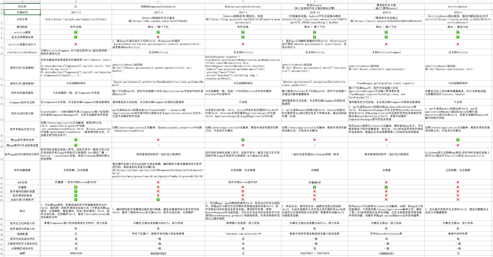

# 前言

android平台上组件化开发的概念近两年非常火热，有些同学反映在面试中被问到的概率也很高。

目前网上关于组件化开发方案的文章、开源库比较多，让很多初学者感到迷茫，不知该从何处入手，自身的业务特性适合使用哪种框架，如果全部都学习一遍成本比较高，而且在学习过程中容易将各方案的一些特性记混淆。

为了让大家能快速对android组件化有个整体的认识，本文将从多个维度对目前网上一些有代表性的开源组件化开发方案进行对比，从而更好的区分各组件化方案的特点，能快速地选择适合自己使用的方案深入学习并使用，在面试中被问到时也能做到心中有数。

由于篇幅及个人精力所限，只选取了比较有代表性的几个组件化方案进行比较，对比内容中如有谬误之处，欢迎大家指正，在github上发布也是为了方便大家[提issue](https://github.com/luckybilly/AndroidComponentizeLibs/issues/new)和[pr](https://github.com/luckybilly/AndroidComponentizeLibs/compare)给我,和我一起完善更多组件化方案的对比，降低开发者学习组件化技术的难度。

持续更新中，欢迎watch、star

# 对比表

图片

表格

对比项|[CC](https://github.com/luckybilly/CC)|[得到DDComponentForAndroid](https://github.com/luojilab/DDComponentForAndroid)|[ModularizationArchitecture](https://github.com/SpinyTech/ModularizationArchitecture)|[阿里Arouter](https://github.com/alibaba/Arouter) (网上很多组件化方案的路由引擎，如[AndroidModulePattern](https://github.com/guiying712/AndroidModulePattern))|聚美组件化方案 （基于[聚美Router](https://github.com/JumeiRdGroup/Router)）|[ActivityRouter](https://github.com/mzule/ActivityRouter)
---|---|---|---|---|---|---
开源时间|2017-11|2017-9|2017-1|2016-12|2016-9|2016-4
介绍文章|[wiki](https://github.com/luckybilly/CC/wiki)|[Android彻底组件化方案实践](https://www.jianshu.com/p/1b1d77f58e84)|[Android架构思考(模块化、多进程)](http://blog.spinytech.com/2016/12/28/android_modularization/)|[开源最佳实践：Android平台页面路由框架Arouter](https://yq.aliyun.com/articles/71687?spm=5176.100240.searchblog.7.8os9Go)|[聚美组件化实践之路](https://juejin.im/post/5a4b4425518825128654eef4)|[ActivityRouter路由框架：通过注解实现URL打开Activity](https://joyrun.github.io/2016/08/01/ActivityRouter/)
通信机制|组件总线|路由 + 接口下沉|组件总线|路由 + 接口下沉|路由 + 接口下沉|路由 + 静态方法
activity跳转|✅|✅|✅|✅|✅|✅
是否支持降级处理|✅|❌|✅|✅|✅|✅
activity变量自动注入|❌|1. 通过apt生成自动注入代码 2. 在onCreate中调用`AutowiredService.Factory.getInstance().create().autowire(this);`或者继承BaseActivity|❌|1. 通过apt生成解析参数的代码 2. 在onCreate方法中调用`ARouter.getInstance().inject(this);`实现自动注入|❌|❌
startActivityForResult|支持Activity/Fragment,但不建议使用 建议使用统一的组件调用方式|仅支持Activity|仅支持Activity|仅支持Activity|支持Activity/Fragment|仅支持Activity
调用方式(页面跳转)|同步直接返回结果或异步回调结果: `CCResult result = CC.obtainBuilder("ComponentA").build().call();` 或 `String callId = CC.obtainBuilder("ComponentA").build().callAsync(new IComponentCallback(){...});`|onActivityResult返回结果: `UIRouter.getInstance().openUri(getActivity(), url, bundle);`|RouterResponse response = LocalRouter.getInstance(MaApplication.getMaApplication()) .route(MainActivity.this, RouterRequest.obtain(MainActivity.this)             .domain("com.spinytech.maindemo:music")             .provider("music")             .action("shutdown")); String temp = response.getData();|onActivityResult返回结果: `ARouter.getInstance().build("/test/activity").navigation();`|onActivityResult返回结果: `Router.create(url).open(context);`|onActivityResult返回结果: `Routers.open(context, url);`
调用方式(调用服务)|与页面跳转相同|`Router.getInstance().getService(ReadBookService.class.getSimpleName())`|与页面跳转相同|`ARouter.getInstance().navigation(HelloService.class).sayHello();`|`PipeManager.get(LoginPipe.class).logout();`|与页面跳转相同
组件向外提供服务|与页面跳转一致，在IComponent中实现|接口下沉到base中，组件中实现接口并在IApplicationLike中添加代码注册到Router中|与页面跳转一致，实现一个对应的Action并在其所属的Provider中注册即可|接口继承IProvider并下沉到base中，组件中实现接口并通过注解来暴露服务|接口下沉到base中，组件中实现接口并在ApplicationDelegate中向接口管理类注册`PipeManager.register(CorePipe.class, new CorePipeImpl());`|在静态方法上加注解来暴露服务，但不支持返回值，且参数固定位(context, bundle)
Fragment组件化支持|在IComponent中实现，并支持后续Fragment内部功能调用|调用服务的方式实现，未支持后续Fragment内部的功能调用|不支持|调用服务的方式实现，未支持后续Fragment内部的功能调用|调用服务的方式实现，未支持后续Fragment内部的功能调用|不支持
组件自动注册方案|TrasnformAPI + ASM扫描组件类(IComponent接口实现类)并注册到ComponentMananger中，无需手动维护组件列表|apt生成各module的路由表 TrasnformAPI + javassist将IApplicationLike的注册代码生成到自定义application.onCreate方法中，无需手动维护组件列表|未实现自动注册， 1. Action列表在其所属的Provider中注册 2. Provider在其所属的ApplicationLogic中注册 3. ApplicationLogic在主app的Application中注册|1. apt生成各module的路由表 2. Arouter初始化时扫描所有dex找出指定包名下的路由表，通过反射进行统一注册|1. apt生成各module的路由表pkg.RouterRuleCreator类 2. 在ComponentPackages中定义所有RouterRuleCreator的包名 3.在BaseApplication中反射所有的包名找到所有路由表RouterRuleCreator 4. 需要手动维护ComponentPackages类中的包名列表|1. apt生成各module的路由表 2. apt在application的module通过Modules注解生成RouterInit进行注册 3. 需要手动维护Modules注解中的组件列表
组件单独运行的方式|切换library/application方式编译，提供2种方式： 1. module/build.gradle中切换`ext.runAsApp=trueOrFalse` 2. 在local.properties中切换`moduleName=trueOrFalse`（推荐使用的方式，不会提交到代码仓库中）|切换library/application方式编译，在module/gradle.properties中切换`isRunAlone=trueOrFalse`|切换library/application方式编译，框架本身没有提供切换方式，开发者自行解决|切换library/application方式编译，框架本身没有提供切换方式，开发者自行解决|组件module始终以library方式编译，额外提供app壳子，可以按需将多个组件依赖进来一起打包。 好处是所有组件调试时包名相同，能满足分享及地图等第三方SDK对包名的要求|切换library/application方式编译，框架本身没有提供切换方式，开发者自行解决
跨app组件调用支持|✅|❌|✅|❌|❌|✅
跨app调用开关及权限设置|✅|/|❌|/|/|❌
组件app运行时调用其它组件|组件同时安装在设备上即可，实际开发中一般是当前正在开发的组件和主app中的组件互相调用. 通过广播 + Service + LocalSocket实现，没有UrlScheme调用时弹出的选择框|将需要调用的组件一起打包才能调用|组件同时安装在设备上即可，实际开发中一般是当前正在开发的组件和主app中的组件互相调用. 通过AIDL实现|一起打包或者通过urlScheme来统一转发|将需要调用的组件一起打包才能调用|UrlScheme原生支持跨app调用,组件同时安装在设备上即可 通过中介Activity转发:RouterActivity
组件依赖隔离|无需依赖、完全隔离|通过插件实现只在打apk包时才添加依赖，编码期间不能直接调用其它组件的代码，想知道如何实现可以戳[这里](https://github.com/luojilab/DDComponentForAndroid/blob/master/build-gradle/src/main/groovy/com.dd.buildgradle/ComBuild.groovy#L118:18)|无需依赖、完全隔离|未隔离|未隔离|无需依赖、完全隔离
AOP支持|拦截器 + 组件内部Action进行AOP|❌|组件内部Action进行AOP|拦截器AOP|❌|❌
拦截器|✅|❌|❌|✅|✅|❌
组件调用的超时设置|✅|❌|❌|❌|❌|❌
组件调用的取消|✅|❌|❌|❌|❌|❌
动态注册/注销组件|✅|✅|❌|❌|❌|❌
特点|1. 可以跨app调用，初期改造时即可单独编译组件运行 2. 提供统一的组件调用及实现方式（不管是否跨app调用、页面跳转、服务调用、同步/异步调用） 3. 组件自动注册，无需维护 4. 提供了ActionProcessor按需加载的支持|1. 编码期间组件依赖通过插件进行隔离，避免直接调用其它组件的代码 2. 提供了兼容ARouter的方案 3. 组件自动注册，无需维护|1. 可以跨app、app内跨进程调用 2. 组件运行在各自进程中，单独运行与联合打包切换时需要修改进程名称 3. 组件需指定同步实现还是异步实现，调用组件时统一拿到RouterResponse作为返回值，可以自行决定同步还是异步方式调用RouterResponse.getData()来获取结果，但异步获取时需要自己维护线程|1. 阿里出品，使用者众多，QQ群里交流比较活跃 2. 自动注册插件正式启用之前扫描所有dex完成注册的方式效率较低且有加固厂商兼容性问题 3. 分级按需加载|组件module可以始终以library方式编译，由统一的app壳子来安装调试，不需要切换library/application编译方式、避免了第三方SDK需要指定包名的问题、自定义权限重复导致安装冲突的问题、误操作导致apk upload到maven仓库的问题等|1. 业内最早的组件化支持库 2. 通过注解静态方法的方式暴露服务
组件定义代码侵入性|新增IComponent接口的实现类来定义组件，侵入性低|注解定义路由及参数自动注入，侵入性高|新增接口实现类，侵入性低|注解定义路由及参数自动注入，侵入性高|注解定义路由，侵入性高|注解定义路由，侵入性高
组件调用代码侵入性|高|高|高|高|高|高
混淆配置|无|所有下沉接口、框架中相关接口的实现类等|`-dontwarn com.spinytech.**`|框架中的所有类及框架相关接口的实现类|所有RouterRuleCreator类|框架中的所有类
老项目改造成本评估|低|一般|高|一般|高|低
方案使用的学习成本评估|低|一般|高|一般|一般|一般
后续维护成本评估|低|一般|高|低|一般|一般
QQ群|686844583|693097923|无|592278657 / 336755078|108895031|无

# 表格中框架的相关链接

序号|名称|相关文章
---|---|---
1|[CC](https://github.com/luckybilly/CC)|[wiki](https://github.com/luckybilly/CC/wiki) [CC框架实践(1)：实现登录成功再进入目标界面功能](https://github.com/luckybilly/CC/wiki/CC%E6%A1%86%E6%9E%B6%E5%AE%9E%E8%B7%B5(1)%EF%BC%9A%E5%AE%9E%E7%8E%B0%E7%99%BB%E5%BD%95%E6%88%90%E5%8A%9F%E5%86%8D%E8%BF%9B%E5%85%A5%E7%9B%AE%E6%A0%87%E7%95%8C%E9%9D%A2%E5%8A%9F%E8%83%BD) [CC框架实践(2)：Fragment和View的组件化](https://github.com/luckybilly/CC/wiki/CC%E6%A1%86%E6%9E%B6%E5%AE%9E%E8%B7%B5(2)%EF%BC%9AFragment%E5%92%8CView%E7%9A%84%E7%BB%84%E4%BB%B6%E5%8C%96) [CC框架实践(3): 让jsBridge更优雅](https://github.com/luckybilly/CC/wiki/CC%E6%A1%86%E6%9E%B6%E5%AE%9E%E8%B7%B5(3):-%E8%AE%A9jsBridge%E6%9B%B4%E4%BC%98%E9%9B%85)
2|[得到DDComponentForAndroid](https://github.com/luojilab/DDComponentForAndroid)|[Android彻底组件化方案实践](https://www.jianshu.com/p/1b1d77f58e84) 组件化设计思路 [浅谈Android组件化](https://mp.weixin.qq.com/s/RAOjrpie214w0byRndczmg) 原理解释文章[Android彻底组件化方案实践](http://www.jianshu.com/p/1b1d77f58e84) demo解读文章[Android彻底组件化demo发布](http://www.jianshu.com/p/59822a7b2fad)
3|[ModularizationArchitecture](https://github.com/SpinyTech/ModularizationArchitecture)|[Android架构思考(模块化、多进程)](http://blog.spinytech.com/2016/12/28/android_modularization/) [ModularizationArchitecture 使用教程](http://blog.spinytech.com/2017/02/01/ma_get_start_cn/)
4|[阿里ARouter](https://github.com/alibaba/ARouter)|[开源最佳实践：Android平台页面路由框架Arouter](https://yq.aliyun.com/articles/71687?spm=5176.100240.searchblog.7.8os9Go)
5|聚美组件化方案[Demo](https://github.com/yjfnypeu/AndroidComponent) (基于[聚美Router](https://github.com/JumeiRdGroup/Router))|[聚美组件化实践之路](https://juejin.im/post/5a4b4425518825128654eef4) [Router:一款单品、组件化、插件化全支持的路由框架](https://juejin.im/post/5a37771f6fb9a0450e7636e0)
6|[ActivityRouter](https://github.com/mzule/ActivityRouter)|[ActivityRouter路由框架：通过注解实现URL打开Activity](https://joyrun.github.io/2016/08/01/ActivityRouter/) [通过 URL 打开 Activity](https://mzule.github.io/2016/04/11/%E9%80%9A%E8%BF%87URL%E6%89%93%E5%BC%80Activity/)

# 其它比较有特色的组件化方案简介

- 51信用卡路由方案[OkDeepLink](https://www.jianshu.com/p/8a3eeeaf01e8)

    *曾经在作者的github账号上开源，现已删除，作者在博文中提到后续2.0版会放到公司的github账号上，但一直未发布。* [这里](https://github.com/jjerry/OkDeepLink)有个fork版本
    
    这个方案中使用aspectJ来实现路由表的自动注册，与其它方案不太一样，不过此方案的作者也打算废弃这种方式，理由是aspectJ还是太重了
    
    这个方案文章中还提到了关于路由安全的措施，其中有使用URL中加签名的方式来屏蔽非法访问，类似于客户端连接服务端的http请求对参数进行加密校验
    
- 组件总线方案[ModuleBus](https://github.com/cangwang/ModuleBus)
    
    介绍文档：[组件化开发跨module交互方式---ModuleBus交互](https://juejin.im/post/58524bd2b123db00655b4e99)

    这个方案的特别之处在于其借鉴了[EventBus](https://github.com/greenrobot/EventBus)的思想，组件的注册/注销和组件调用的事件发送都跟EventBus类似，
    
- 美柚路由方案[RouterKit](https://github.com/gybin02/RouterKit)
    
    这个方案的特别之处在于其组件自动注册的方案：通过apt生成每个module的路由表，然后[复制到app的assets目录](https://github.com/gybin02/RouterKit/blob/master/app/build.gradle#L60:1)，运行的时候遍历asset目录，[反射对应的activity](https://github.com/gybin02/RouterKit/blob/master/jet_router/src/main/java/com/meiyou/router/Router.java#L322:17)
    
    
- 其它（欢迎给我[提issue](https://github.com/luckybilly/AndroidComponentizeLibs/issues/new)或[pr](https://github.com/luckybilly/AndroidComponentizeLibs/compare)补充!）